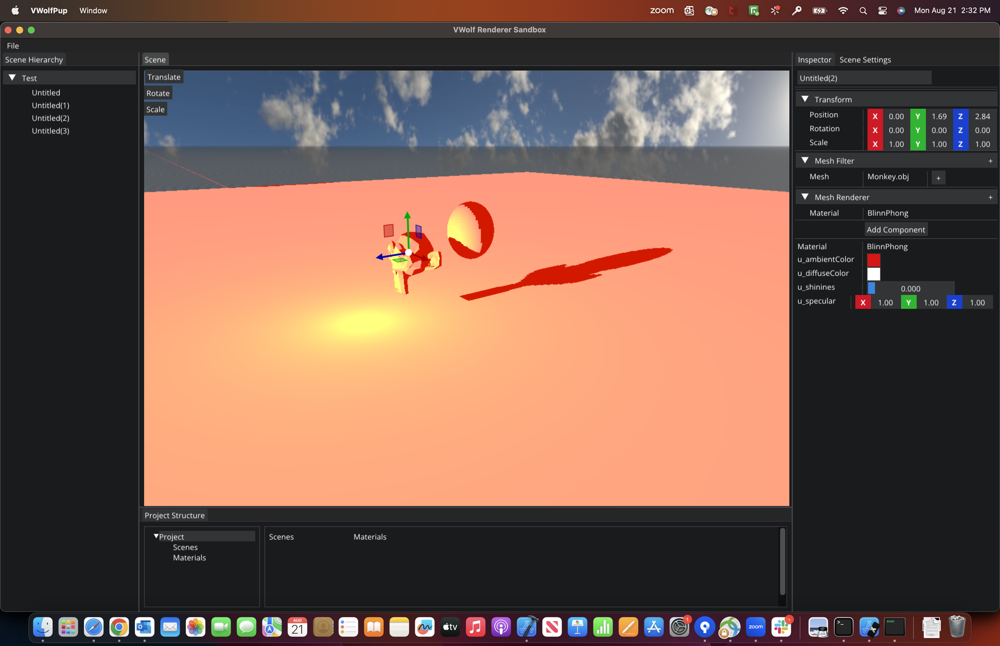

# VWolf

Project inspired by the [Game engine series](https://www.youtube.com/playlist?list=PLlrATfBNZ98dC-V-N3m0Go4deliWHPFwT) by [The Cherno](https://www.youtube.com/@TheCherno), this repo contains code to make a game engine core and a demo app to test its implementation. 

## Objective

This project pretends to have a basic render with the required capabilities like geometry handling, lighting, materials, textures and shadows. The goal is to create the core renderer and scene management to allow the creation of multiple applications with it.

## Project Structure

### VWolf

VWolf is a library with basic functionality for making games. It includes the follow:

- Core: Core functionality that wraps code to help make games, such as:
    - Math
    - Render
		- Skybox		
		- Shadows
    - Scene management
	- Project management
	- Load 3d models
    - Window and Driver management
    - Log 
    - Debug (shape creator helper methods)
    - Game objects and components
        - Light and shape components
    - UI creation (ImGui)
    - Tools

It wraps multiple libraries and it creates a static library to be used inside console applications.

- Platform: Low level code to work with multiple graphics and windows libraries. Right now it includes:
    - Windows with DirectX 12
    - Multiplatform with OpenGL.

### Sandbox

Project that helps testing the multiple features of VWolf.

### VWolfPup

Editor project that will help the user to create the project/scenes to make a game. Right now it includes:

- Scene hierarchy (Add and delete game objects)
- Game object inspector (Add and delete components)
- Scene viewer (Guizmo controllers)
- Scene settings
- Open/Save scenes.

## Dependencies

### Internal (user does not need to get them separately)
- OpenGL (Glad)
- GLFW
- ImGui
- GLM
- DirectX 12
- Windows.h
- STB Image
- Yaml-CPP
- ImGuizmo
- entt.

### External (User needs to download them and compile them, or attach them using the Package manager from visual studio)
- Boost
- WinPix (attach using Package manager. Windows only). **Note: Will remove and use render docs instead**.

## Installation mode

This projects requires premake5 to be included in your local machine. All **premake5.lua** files are inside the dependencies and the projects, as such in the root directory to create the workspace. Will suggest this [video](https://www.youtube.com/watch?v=sULV3aB2qeU&list=PLlrATfBNZ98dC-V-N3m0Go4deliWHPFwT&index=7) to learn how to set up the project, but in summary:

### Prerequisite

Download Boost and compile it. Create static libraries.

### Steps

- Pull the project with the dependencies (recursive)
- Download premake5 for your OS and put it inside the *bin* folder.
- Change the variables **boostversion** and **boost** inside the **premake5.lua** file in the root directory with your own.
- Run the *generate* script inside the **scripts/{OS}** folder.
- Open project file.
- **Windows only** Attach winpixruntime using Visual studio's package manager.

## Future goals

- Cleanup
    - Divide sub namespaces
    - Memory management (fix memory leaks).
- Window management
    - Clean events code
    - Event queue
    - Multithreading
- Render
    - Multiple lights (remove the 8 light cap).
    - Postprocessing (Maybe??)
- Scene management update
    - More settings
- Components
    - Camera component
    - More render components (Line, billboard, etc...)
- Material system
    - Basic render (PBR)
- Expand driver integration
    - Cocoa and Metal
    - GLFW and Vulkan
- Physics system
- Scripting
- Audio

## References

- [Game engine series](https://www.youtube.com/playlist?list=PLlrATfBNZ98dC-V-N3m0Go4deliWHPFwT) by [The Cherno Channel](https://www.youtube.com/@TheCherno)
- [DirectX 12 Render](https://www.youtube.com/playlist?list=PLU2nPsAdxKWQw1qBS9YdFi9hUMazppjV7) by [Game engine series Channel](https://www.youtube.com/@GameEngineSeries)
